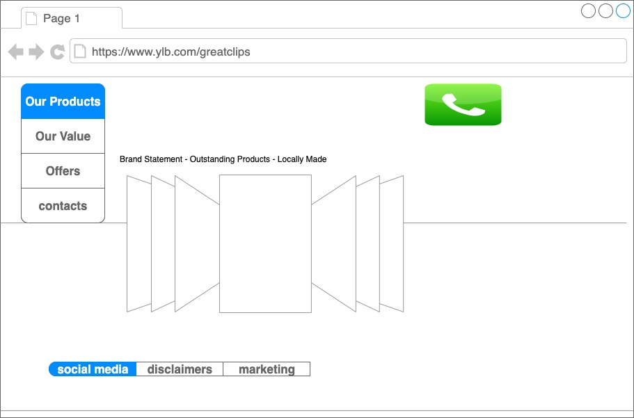

# project1ylb
full-stack partner project

# 

## Why Release Pro?

Release Pro was created for engineering teams to use to help keep track of all the steps it takes for an app to be released for production. All the pertinent information is easily available for any member to find out about current releases and any previous release.

## User Story

As a member of an engineering team, I want to be able to quickly view information about our current app releases and the status of release candidates.

Engineering team members will be able to create an account and log in. The team member will be able to go to their profile and edit their information.

The team member will land on the Release tab of the app. The releases will be shown in card form factor with current releases shown and previous releases shown under current releases.

Any team member can create a Release Form. Each release form will have information that is specific to that release such as type, OS, version, release manager, experiments, and notes. After a form has been submitted, additional fields will show to add incidents and post mortem notes.

Each member will have access to the Features Owner Doc. This doc will be a source of truth for all project owners. Members will be able to see all key stakeholders and relevant information relating to the feature such as slack channels, tech specs, product specs, testing specs, and key PR’s

## Wireframes

## Data Models

## ERD

## Milestones

Create Frontend/Backend

Create Users

Create Release Forms

Create Features Owner Doc

Create Landing

## Dependencies Installed

bcryptjs

body-parser

connect-mongo

express

express-session

handsontable

mongodb

mongoose

nodemon

## Technologies

Frontend - HTML, CSS, JS

Backend - Mongoose, Express, Node

Auth - Users
