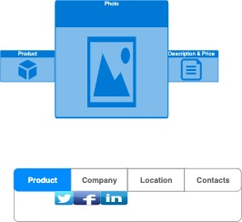
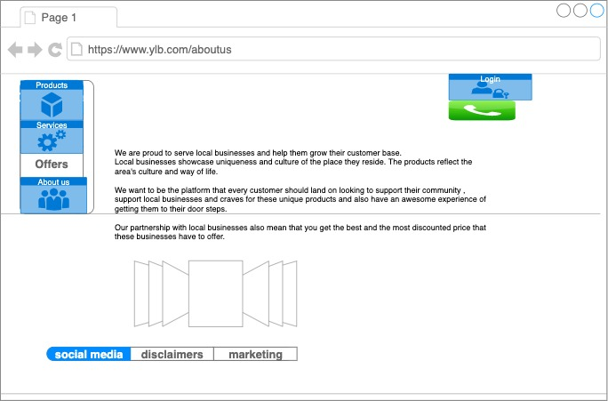
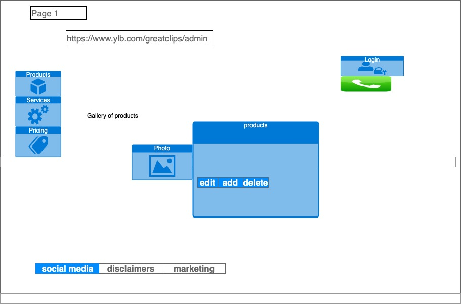
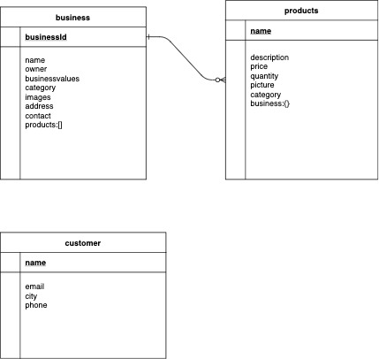

# project1ylb
ylb - Your Local Business

# 

## ylb - What is it?

YLB stands for your local business. Its a platform for local businesses to expand their reach to local communities.
We are proud to serve local businesses and help them grow their customer base. A local business showcases the culture that they have grown up to love. The products reflect the area’s regional history and industries.This platform is there to guide customers to the local goods and services they need, all while adding to the local economy in an environtmentally friendly way.

## User Story

User will navigate home page. There will be a nav bar with about page, businesses, products, sign up, and contact to guide user throughout website.

The business user will have a marketing platform to market themselves and will be connected to their products/services page.

The business user will be able to update, delete, and add products to their respectable page after logging in.

The consumer client users have the ability to search for products/services via business or product search.

There will be a log for businesses to update their business home page or their products. 

There will be a log in for Consumers to claim local discounts and special offers.

## Wireframes

## Data Models

Product Schema

Business Schema

User Schema

## ERD

## Milestones

Create Schema/Populate

Create Backend

Create Frontend

Stylize Pages

Create Auth&Search

Create ReadMe

## Dependencies Installed

bcryptjs

body-parser

express

express-session

method-override

morgan

mongodb

mongoose

dotenv

## Technologies

Frontend - HTML, CSS, JS, Canva, Flaticon, Unplash, Trello

Backend - Mongoose, Express, Node

Auth - Users

